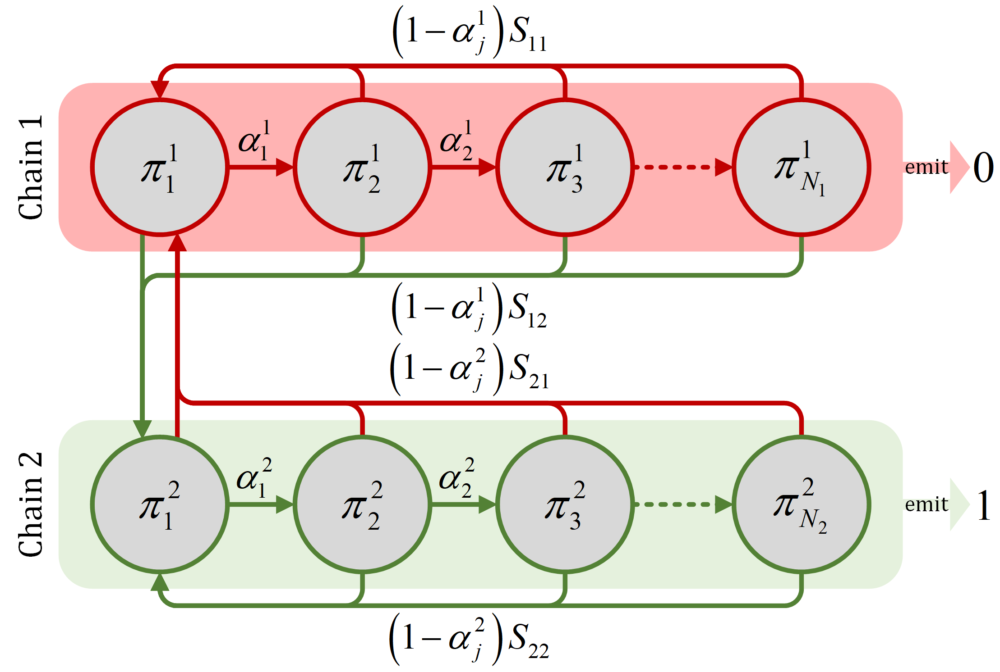
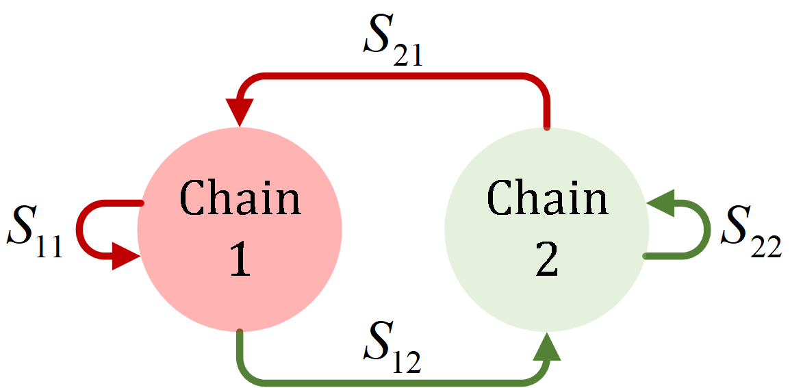
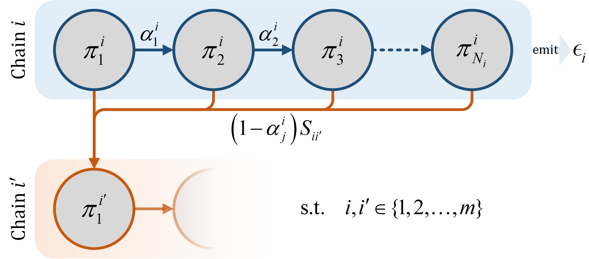

Pseudo-Random Multinomial Distribution
======


A package for drawing samples from pseudo-random multinomial distribution.

## Key Ideas


### Notations

|         Term          |                                                    Meaning                                                     |
|:---------------------:|:--------------------------------------------------------------------------------------------------------------:|
|         $N_i$         |                                         Number of states of chain $i$                                          |
|       $\pi^i_j$       |                      Stationary of state $j$ of chain $i$, also used to denote that state                      |
| $\alpha^i_j$, $e^i_j$ | _Linger_ probability $\alpha^i_j = 1 - e^i_j$, where $e^i_j$ is the exit probability of state $j$ of chain $i$ |
|     $\epsilon_i$      |                           The event emitted by all states belonging to the chain $i$                           |
|       $S_{ik}$        |                           _Chain transition probability_ from chain $i$ to chain $k$                           |
|         $E_i$         |                     Expectation (number of consecutive occurrences) of event $\epsilon_i$                      |
|         $P_i$         |                                   Nominal probability of event $\epsilon_i$                                    |

### Background

In our unpublished work, we want to generate 0/1 bits such that 0 (failure) or 1 (success) events are promoted to occur
consecutively, forming clusters.
Additionally, we also want to be able to set the expected number of consecutive occurrences and overall nominal
probability at will.

For this purpose, we propose a statistical method called pseudo-random binomial distribution.
It is based on a **Markov State Machine** consisting of a pair of sequential chains.
Each chain $i \in \{1,2\}$ has $N_i$ states (which can possibly go up to infinity), and all states belonging to
the chain $i$ emit a predefined event $\epsilon_i \in \{0,1\}$.
At each state $\pi^i_j$, the transition probability to $\pi^i_{j+1}$ is denoted $\alpha^i_j$.
We refer to this probability as lingering probability as it presents the likelihood of advancing to the next state $j+1$
in that chain.
Its compensation is called exit probability $e^i_j = 1 - \alpha^i_j$.
While exiting, the next state can only be the first state $\pi^k_1$ of the chain $k$,
with the transition probability being $S_{ik} * e^i_j$.


<p align="center">
    
</p>

The term $S_{ik}$ satisfying $\sum\limits_{k=1}^{2}{S_ik} = 1$ is called the chain transition probability in the sense
that if each chain only has a single state, the matrix of $S_{ik}$ become the transition matrix.

```math
S = \begin{bmatrix}
S_{11} & S_{12} \\ 
S_{21} & S_{22}
\end{bmatrix}
```

<p align="center">
    
</p>

The key idea is that we constrain the transition probabilities as follows:
- The lingering probabilities $\alpha^i_k$ must be a monotonically decreasing series:
```math
\alpha^i_j > \alpha^i_{j+1} \quad \forall i \in \{1,2\}, j \in \{1,2,...,N_i\}
```
- The lingering probability at the final state $N_i$ of the chain $i$ is always 0.
This constraint is expressed as a limit as $N_i$ can be infinity.
```math
\lim_{j \to N_i} \alpha^i_j = 0 \quad \forall i \in \{1,2\}
```
- The self-chain transition probability is zero.
```math
S_{ii} = 0 \quad \forall i \in \{1,2\}
```

Informally, at the beginning of each chain $i$, the next emitted event is more likely to be $\epsilon_i$ as the
lingering probability is higher.
In the subsequent timestamps, the lingering probability gradually decreases and approaches zero, at which the machine
will certainly switch to the other chain $k \ne i$ (because of the third constraint), ending the string of $\epsilon_i$
emission.

To make the process controllable, we use parameterized functions $f^\alpha_i$ (or $f^e_i$) to generate
$\alpha^i_j$ (or $e^i_j$, respectively):

```math
\alpha^i_j = f^\alpha_i(j)
```

Their parameters can then be solved to ensure a desired overall occurrence of an event $\epsilon_i$, or the desired
length of the string of consecutive $\epsilon_i$.
In the following sections, we will brief the results that need to be provoked to formulate the algorithm for this.
For the detailed proofs, please refer to the paper.

This method can be easily generalized to pseudo-random multinomial distribution of $m$ events,
Nonetheless, the state transition matrix $S$ as well as the series of lingering probabilities can be modified to exhibit
different behaviors (see [Examples](#examples)).

<p align="center">
    
</p>

### Expectation

The base expectation of an elementary chain is computed as sum of cumulative product of lingering probability $\alpha_k$
(the probability of transitioning to the next state instead of exiting the chain).
This can be easily proved using different methods.

|                          |                          Finite chain                          |                           Infinite chain                            |
|:------------------------:|:--------------------------------------------------------------:|:-------------------------------------------------------------------:|
| Base Expectation Formula | $E=1+\sum\limits_{j=1}^{n}{\prod\limits_{k=1}^{j}{\alpha_k}}$  | $E=1+\sum\limits_{j=1}^{\infty}{\prod\limits_{k=1}^{j}{\alpha_k}}$  |

The formula of finite chains (with reasonably small number of states) can be easily computed.
Meanwhile, for infinite chains, the sum of cumulative product of linger probabilities is a series that always converge
if $\lim_{k\rightarrow\infty}{\alpha_k}=0$ (or $\lim_{k\rightarrow\infty}{e_k}=1$).
It's limit can be estimated using [Wynn's Epsilon method](https://mathworld.wolfram.com/WynnsEpsilonMethod.html).

Then, the (real) expectation of each chain $\mathbf{E}_i$ in a system of multiple chains is computed as:
```math
\mathbf{E}_i=\frac{E_i}{1-S_{ii}}
```

### Probability

To compute nominal probabilities, we need first to compute the entrance stationary $\pi^i_1$ of each chain.
This is done by solving the following system of linear equations:

```math
\left\lbrace\begin{array}{@{}l@{}l@{}l@{}l@{}l@{}}
S_{11}\pi^1_1 &+ S_{21}\pi^2_1 &+ \cdots &+ S_{N1}\pi^N_1 &= \pi^1_1 \\ 
S_{12}\pi^1_1 &+ S_{22}\pi^2_1 &+ \cdots &+ S_{N2}\pi^N_1 &= \pi^2_1 \\ 
 & & \vdots & & \\ 
S_{1N}\pi^1_1 &+ S_{2N}\pi^2_1 &+ \cdots &+ S_{NN}\pi^N_1 &= \pi^N_1 \\ 
E_1\pi^1_1 &+ E_2\pi^2_1 &+ \cdots &+ E_N\pi^N_1 &= 1 \quad\quad (\sum\limits_{ij}{\pi^i_j}=1)
\end{array}\right.
```

Note that the last equation contains the relationship between the expectation, entrance stationary, and probability 
of event $\epsilon_i$:

$$ P_i = E_i\pi^i_1 $$

## Requirements

- Python 3.6+
- numpy
- cython (to compile)
- cy-root

## Installation

[pseudo-multinomial](https://test.pypi.org/project/pseudo-multinomial/) has pre-built binaries hosted at **TestPyPI**
(for now):
```bash
pip install -i https://test.pypi.org/simple/ pseudo-multinomial
```

Otherwise, pull this repo and install from source (requires a C++ compiler):
```bash
pip install .
```
Or build binaries inplace for development:
```bash
python setup.py build_ext -i
```

## Usage

### Examples

#### Example 1: Coin flip
In this example, we replicate the perfect coin flip using a pair of `ForwardingChain`:
```python
from pseudo_multinomial import MasterChain, ForwardingChain

g = MasterChain(
    chains=[ForwardingChain(),  # this chain has 100% exit probability
            ForwardingChain()],
    chain_transition_matrix=[
        [.5, .5],  # both chains have 50% chance to
        [.5, .5],  # be chosen.
    ])

print(g.pseudo_multinomial(100))  # draw 100 samples
```
Output:
```
[1 0 1 0 0 1 1 0 1 1 0 1 0 0 0 0 0 0 0 1 1 1 0 0 0 0 1 1 0 1 1 1 0 0 1 0 1 0 0 1 0 0 1 0 1 0 0 0 1 1 0 1 1 0 1 0 0 0 1 0 0 0 0 1 1 0 0 1 0 0 1 1 1 1 0 0 1 0 1 0 1 1 1 0 0 1 0 1 0 0 1 1 1 0 1 0 0 0 0 1]
```

By modifying the chain transition matrix $S$, we can create different behaviors:
```python
g = MasterChain(
    chains=[ForwardingChain(),
            ForwardingChain()],
    chain_transition_matrix=[
        [0, 1],  # alternate between chains
        [1, 0],
    ])

print(g.pseudo_multinomial(100))
```
Output:
```
[1 0 1 0 1 0 1 0 1 0 1 0 1 0 1 0 1 0 1 0 1 0 1 0 1 0 1 0 1 0 1 0 1 0 1 0 1 0 1 0 1 0 1 0 1 0 1 0 1 0 1 0 1 0 1 0 1 0 1 0 1 0 1 0 1 0 1 0 1 0 1 0 1 0 1 0 1 0 1 0 1 0 1 0 1 0 1 0 1 0 1 0 1 0 1 0 1 0 1 0]
```

#### Example 2: Unnatural dice
In this example, we create an unnatural 6-faced dice that usually generate consecutive results using 
the `HarmonicChain`:
```python
from pseudo_multinomial import MasterChain, HarmonicChain

g = MasterChain.from_pvals(
    chains=[HarmonicChain(c=.5),
            HarmonicChain(c=.5),
            HarmonicChain(c=.5),
            HarmonicChain(c=.5),
            HarmonicChain(c=.5),
            HarmonicChain(c=.5)],
    pvals=[1/6] * 6,
    repeat=True)

print(g.pseudo_multinomial(100))
```
Output:
```
[2 0 0 0 0 3 3 3 1 1 5 5 0 0 0 1 1 1 0 2 2 2 5 1 1 1 1 1 5 4 1 5 5 0 0 0 0 4 4 4 4 4 3 0 5 5 5 5 5 0 0 4 1 4 4 0 0 2 3 3 3 2 2 4 4 4 4 4 4 3 4 4 4 4 4 4 4 4 3 1 1 5 5 5 4 2 5 4 4 4 5 5 1 2 1 1 1 0 0 0]
```
Each event occurs approximately 2.63 times consecutively, however, the nominal probability of each event is still
exactly $1/6$:
```python
print(g.expectations())
# [2.63343366 2.63343366 2.63343366 2.63343366 2.63343366 2.63343366]
print(g.probs())
# [0.16666667 0.16666667 0.16666667 0.16666667 0.16666667 0.16666667]
```

#### Example 3: The Dota 2 Pseudo-random _Binomial_ Distribution
If you are a **Warcraft 3** or **Dota 2** fan, you may notice that these games have a statistical mechanic affecting
certain skills or items.
It discourages the consecutive occurrence of success events to limit the influence of luck.
It works by slowly increasing the success probability by a constant $c$ after every failure event, and reset to
$c$ after a success event.

We can recreate this with a `LinearChain` with `initial_state=2` for failure event (0) and a `ForwardingChain` for
success event (1).
The success chain can also repeat itself with probability $S_{22}=c$, while the failure chain always transit to success
chain after exiting $S_{12}=1$.

This example also shows the use of the `RootFindingSolver` to optimize a single parameter $c$ to get a desired nominal
probability of success event:
```python
from pseudo_multinomial import MasterChain, LinearChain, ForwardingChain
from pseudo_multinomial.solver import RootFindingSolver

c = 0.3  # approximate p=0.5
g = MasterChain(
    chains=[LinearChain(c=c, initial_state=2),
            ForwardingChain()],
    chain_transition_matrix=[
        [0., 1.],
        [1 - c, c],
    ])


def update_param_fn(c):  # function to update parameter c
    g.chains[0].c = c
    g.S[1, 1] = c
    g.S[1, 0] = 1 - c


p = 0.05
while p < 1.01:
    solver = RootFindingSolver(objective_fn=lambda: g.probs()[1],
                               objective_val=p,
                               update_param_fn=update_param_fn)
    solver.solve(method='bisect', a=1e-7, b=1, etol=1e-15, ertol=0, ptol=0, prtol=0)
    print(f'desired_p={p:.02f}, solved_p={g.probs()[1]:.05f}, c={g.chains[0].c}')
    p += .05
```
Output:
```
desired_p=0.05, solved_p=0.05000, c=0.003801658303553148
desired_p=0.10, solved_p=0.10000, c=0.01474584478107244
desired_p=0.15, solved_p=0.15000, c=0.03222091437308729
desired_p=0.20, solved_p=0.20000, c=0.055704042949781624
desired_p=0.25, solved_p=0.25000, c=0.08474409185231699
desired_p=0.30, solved_p=0.30000, c=0.11894919272540436
desired_p=0.35, solved_p=0.35000, c=0.15798309812574696
desired_p=0.40, solved_p=0.40000, c=0.20154741360775413
desired_p=0.45, solved_p=0.45000, c=0.24930699844016374
desired_p=0.50, solved_p=0.50000, c=0.3021030253487422
desired_p=0.55, solved_p=0.55000, c=0.36039785093316745
desired_p=0.60, solved_p=0.60000, c=0.4226497308103737
desired_p=0.65, solved_p=0.65000, c=0.4811254783372293
desired_p=0.70, solved_p=0.70000, c=0.5714285714285714
desired_p=0.75, solved_p=0.75000, c=0.666666666666665
desired_p=0.80, solved_p=0.80000, c=0.7500000000000004
desired_p=0.85, solved_p=0.85000, c=0.8235294117647065
desired_p=0.90, solved_p=0.90000, c=0.8888888888888895
desired_p=0.95, solved_p=0.95000, c=0.9473684210526316
desired_p=1.00, solved_p=1.00000, c=1.0
```

Note that the `LinearChain` has finite number of states $n=\lceil\frac{1}{c}\rceil$, meaning that there will be a state
at which the exit probability (probability of success event) is 1.
Replacing it with any infinite chain will theoretically remove the upper bound of number of rolls before a success
event procs.

See more: https://dota2.fandom.com/wiki/Random_Distribution

#### Example 4: Custom Chain

To define a custom chain, you can either extend the base classes (`Chain`, `FiniteChain`, `InfiniteChain`) or
use the `LambdaChain`.

This example defines:
- A finite `QuadraticChain`:  $e_k = c.k^2$ with number of states $n=\left\lfloor\sqrt{\frac{1}{c}}\right\rfloor$.
- An infinite `AlgebraicChain`: $e_k = \frac{\sqrt{c}.k}{\sqrt{1 + c.k^2}}$, which has nice properties
  $e_0=0$ and $\lim_{k\rightarrow\infty}{e_k}=1$.

```python
import math

from pseudo_multinomial import (
    MasterChain, LinearChain, GeometricChain,
    FiniteChain, InfiniteChain  # Base classes
)
from pseudo_multinomial.utils import check_chain


class QuadraticChain(FiniteChain):
    def __init__(self, c=1., *args, **kwargs):
        super().__init__(*args, **kwargs)
        self.c = c

    def exit_probability(self, k: int):  # override this method
        return self.c * k ** 2

    def n_states(self):  # override this method
        return math.floor(math.sqrt(1 / self.c))

    def __repr__(self):
        return f'{self.__class__.__name__}(c={self.c})'


class AlgebraicChain(InfiniteChain):
    def __init__(self, c=1.):
        super().__init__()
        self.c = c

    def exit_probability(self, k: int):  # override this method
        return math.sqrt(self.c) * k / math.sqrt(1 + self.c * k ** 2)

    def __repr__(self):
        return f'{self.__class__.__name__}(c={self.c})'


g = MasterChain.from_pvals([
    LinearChain(c=0.4),
    GeometricChain(a=1, r=.2),
    QuadraticChain(c=.15),
    AlgebraicChain(c=7),
], repeat=False)

check_chain(g, n_rolls=100000)
```
Output:
```
[Checking] n_rolls=100000
MasterChain(
	0: LinearChain(c=0.4),
	1: GeometricChain(a=1.0, r=0.2),
	2: QuadraticChain(c=0.15),
	3: AlgebraicChain(c=7),
)
--------------------------------------------------
Chain transition matrix:
[[0.         0.33333333 0.33333333 0.33333333]
 [0.33333333 0.         0.33333333 0.33333333]
 [0.33333333 0.33333333 0.         0.33333333]
 [0.33333333 0.33333333 0.33333333 0.        ]]
--------------------------------------------------
analytical probs: [0.27814694 0.19536008 0.3541522  0.17234078]
simulated probs : [0.27882 0.19422 0.353   0.17396]

analytical expectations: [1.72       1.2080641  2.19       1.06571782]
simulated expectations : [1.72569165 1.20193081 2.19281898 1.06743572]
```
Besides, you can write your own Cython Chain and build from source.

For more examples, check the [`examples`](examples) folder (will be added soon).

## License

The code is released under the MIT license. See [`LICENSE.txt`](LICENSE.txt) for details.
